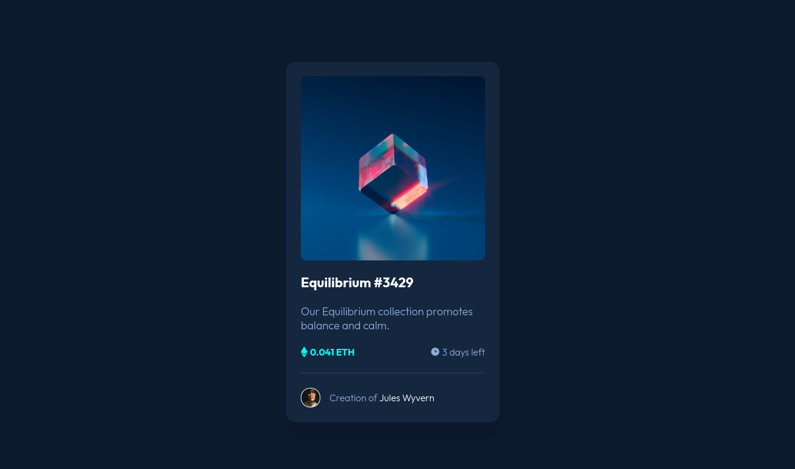

# Frontend Mentor - NFT preview card component solution

This is a solution to the [NFT preview card component challenge on Frontend Mentor](https://www.frontendmentor.io/challenges/nft-preview-card-component-SbdUL_w0U). Frontend Mentor challenges help you improve your coding skills by building realistic projects, its really great stuff!

## Table of contents

- [Overview](#overview)
  - [The challenge](#the-challenge)
  - [Screenshot](#screenshot)
  - [Links](#links)
- [My process](#my-process)
  - [Built with](#built-with)
  - [What I learned](#what-i-learned)
- [Author](#author)

## Overview

### The challenge

Users should be able to:

- View the optimal layout depending on their device's screen size
- See hover states for interactive elements

### Screenshot



### Links

- Solution URL: [Add solution URL here](https://your-solution-url.com)
- Live Site URL: [Add live site URL here](https://your-live-site-url.com)

## My process

### Built with

- Candle Library Wick
- CSS Flexbox
- CSS Transform 3D
- Mobile-first workflow
- [Wick](https://github.com/CandleLibrary/candle-library-workspace/tree/main/packages/wick) - Web Component Compiler

### What I learned

I used this project as basic trail run a hot-module reloading solution in Wick. It helped me flush out some bugs
in the code and get the basic developers experience working. 

The NFT card is built as a self contained component that has properties that can be individually set:

```jsx
<card 
    src="images/image-equilibrium.jpg"
    title="Equilibrium #3429"
    description="Our Equilibrium collection promotes balance and calm."
    denomination="ETH"
    value="0.041"
    time="3 days"
    creator="Jules Wyvern"
/>
```

If you want more help with writing markdown, we'd recommend checking out [The Markdown Guide](https://www.markdownguide.org/) to learn more.

## Author

- Website - [Add your name here](https://github.com/acweathersby)
- Frontend Mentor - [@yourusername](https://www.frontendmentor.io/profile/acweathersby)
